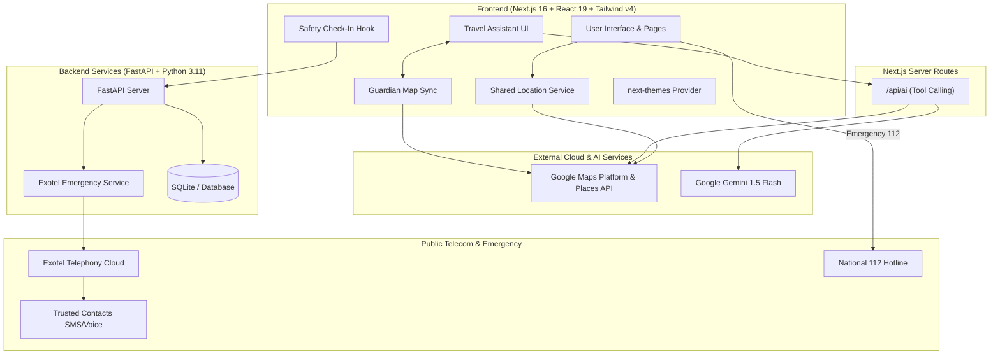
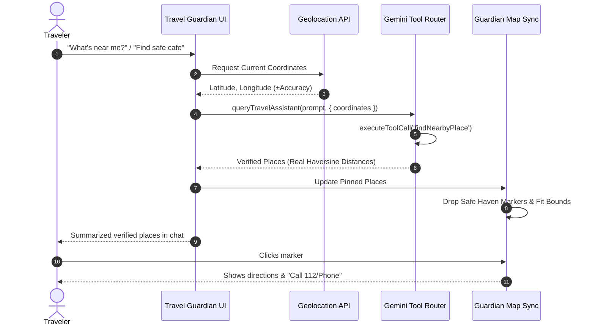
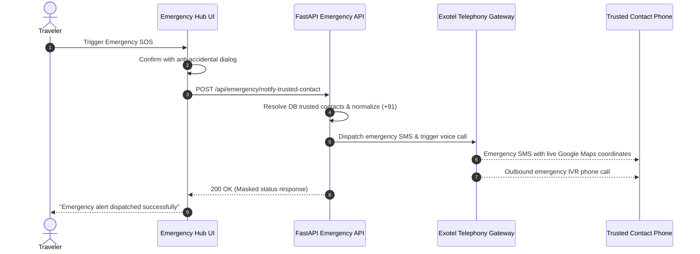

# Travel Guardian

> **Intelligent, Production-Quality Travel Safety & Navigation Platform**

Travel Guardian is a full-stack, AI-assisted travel safety and navigation application designed to protect travelers across regional corridors and highway networks. It combines multi-profile route intelligence, live Google Maps Platform spatial mapping, Gemini 1.5 Flash AI tool calling, dead-man check-in safety timers, offline survival packs, and multi-channel emergency SOS dispatch via India's National Emergency line (112) and Exotel telecommunications.

---

## 📋 Table of Contents

- [Overview](#overview)
- [Problem Statement](#problem-statement)
- [Solution](#solution)
- [Key Features](#key-features)
- [System Architecture](#system-architecture)
- [Architecture Diagrams](#architecture-diagrams)
- [Technology Stack](#technology-stack)
- [Environment Configuration](#environment-configuration)
- [Run & Installation Instructions](#run--installation-instructions)
- [Verification & Testing](#verification--testing)
- [Project Documentation](#project-documentation)

---

## 🔎 Overview

Travel Guardian bridges the critical gap between conventional turn-by-turn navigation apps (which optimize exclusively for speed or distance) and personal security. By evaluating road lighting, historical incident rates, verified safe havens, and cellular signal dead zones, Travel Guardian empowers solo travelers, women, families, and night drivers to make informed safety decisions.

---

## ⚠️ Problem Statement

Modern travelers face several unaddressed safety risks:
1. **Speed vs. Safety Blindspots**: Navigation services frequently route drivers through unlit, isolated rural roads to save 2–3 minutes, creating extreme vulnerability during nighttime or vehicle breakdowns.
2. **AI Hallucinations in Emergency**: Generic AI chatbots fabricate nearby hospitals, fake police stations, and invented distances when travelers need urgent assistance.
3. **Connectivity Vulnerability**: In cellular dead zones, cloud routing and emergency dispatch tools fail completely without offline vector corridors and emergency protocols.
4. **Passive Panic Buttons**: Traditional SOS buttons often rely on manual initiation during high-stress scenarios rather than automated fail-safe check-in timers.

---

## 🛡️ Solution

Travel Guardian resolves these issues through a multi-tiered architecture:
- **Deterministic Safety Fit Scoring**: Transparent 0–100 safety score evaluating lighting, police frequency, verified trauma centers, and traffic health.
- **Strictly Grounded AI Guardian**: Gemini 1.5 Flash assistant with deterministic tool calling; queries real GPS coordinates to locate verified havens with zero hallucination.
- **Two-Way Chat & Map Synchronization**: Chat queries ("What's near me?") plot verified pins directly onto the interactive Google Maps canvas, and map pin selection injects context into the assistant.
- **Automated Dead-Man Safety Check-In**: Configurable countdown cycles with grace periods. If unconfirmed, alerts escalate to trusted guardians via SMS/voice calls.
- **Exotel Emergency Telecommunications**: Masked caller IDs, regulatory E.164 phone normalization, request debouncing, and direct 112 dialing integration.
- **Offline Survival Architecture**: Pre-cached corridor routes, turn-by-turn instructions, and printable survival PDFs.

---

## 🌟 Key Features

1. **Multi-Profile Journey Planning (`/plan`)**:
   - Calculates 4 comparative corridors: Safe Corridor (Main NH), Fast Bypass, Balanced Highway, and Caution Route.
   - Tailored profiles: Solo Traveler, Women Safety Prioritization, Family Travel, and Night Driving.
2. **Interactive Live Navigation & Map (`/map`)**:
   - Google Maps JavaScript API interactive mapping with live GPS tracking, heading, and speed telemetry.
   - Layers for 24/7 verified hospitals, police posts, EV charging, fuel bunks, and rest plazas.
3. **AI Guardian Assistant (`/assist`)**:
   - Dedicated split-view layout on desktop and responsive tab view on mobile.
   - Independent chat scroll container preventing outer page scrolling.
   - Strict tool execution: `findNearbyPlace`, `readSafetyState`, `readCheckInState`, `getArrivalEstimate`.
4. **Emergency Hub & SOS (`/emergency`)**:
   - Direct National Emergency 112 hotline dialer (`tel:112`).
   - One-tap SOS notification to trusted contacts via Exotel SMS and Voice Calls.
   - Anti-accidental confirmation barriers and live GPS snapshot sharing.
5. **Offline Survival Guardian (`/offline-mode`)**:
   - Zero-signal emergency checklists, nearest offline POI indexes, and PDF route generators.
6. **Unified Design System & Themes (`/settings`)**:
   - Daylight Travel Light Theme and Deep Night Corridor Dark Theme.
   - Accessible WCAG AA color tokens, smooth theme switching, and reduced-motion compliance.

---

## 🏛️ System Architecture



---

## 📊 Core User Workflows

### 1. "What's Near Me?" — Real GPS AI Synchronization


### 2. Emergency Escalation Workflow


---

## 💻 Technology Stack

| Layer | Technology | Purpose | Status |
|---|---|---|---|
| **Frontend Framework** | Next.js 16 (Turbopack) | Server Components, routing, and PWA shell | Active |
| **Language** | TypeScript 5.9 | Static type checking and safety interfaces | Strict |
| **Styling & Tokens** | Tailwind CSS v4 + Vanilla CSS | CSS variables, responsive design, dark mode | Active |
| **Mapping Engine** | Google Maps JavaScript API | Interactive maps, route polylines, GPS markers | Active |
| **Places & Geocoding** | Google Places & Geocoder API | Autocomplete, reverse geocoding, and routing | Active |
| **AI Intelligence** | Gemini 1.5 Flash + Tool Router | Deterministic tool execution without hallucinations | Active |
| **Backend API** | FastAPI (Python 3.11) | REST endpoints, models, Exotel integration | Active |
| **Database** | SQLite / SQLAlchemy | User profiles, emergency contacts, incident reports | Active |
| **Telecommunications** | Exotel REST API | Emergency SMS dispatch and outbound voice IVR | Integrated |
| **Offline Engine** | Service Worker + Cache API | Offline corridor caching and PDF survival cards | Active |
| **Icons** | Lucide React | Consistent accessible iconography | Active |

---

## ⚙️ Environment Configuration

### Frontend (`frontend/.env.local`)
| Variable | Description | Exposure |
|---|---|---|
| `NEXT_PUBLIC_GOOGLE_MAPS_API_KEY` | Public Google Maps JavaScript API key | Public |
| `NEXT_PUBLIC_API_URL` | Base URL pointing to FastAPI backend | Public |
| `GEMINI_API_KEY` | Google AI Studio API key for Gemini 1.5 Flash | Server-Only |
| `GEMINI_MODEL` | Target Gemini model (`gemini-1.5-flash`) | Server-Only |

### Backend (`backend/.env`)
| Variable | Description | Exposure |
|---|---|---|
| `DATABASE_URL` | SQLAlchemy database connection string | Private |
| `EXOTEL_ACCOUNT_SID` | Exotel Account SID | Private |
| `EXOTEL_API_KEY` | Exotel API Key | Private |
| `EXOTEL_API_TOKEN` | Exotel API Token | Private |
| `EXOTEL_SUBDOMAIN` | Exotel cluster subdomain (e.g., `api.exotel.com`) | Private |
| `EXOTEL_CALLER_ID` | Approved Exotel virtual number / ExoPhone | Private |
| `EXOTEL_APP_ID` | Flow App ID for automated outbound emergency calls | Private |

*(Never commit actual secret values or credentials to Git).*

---

## 🚀 Run & Installation Instructions

### Prerequisites
- Node.js 18.17+ or 20+
- Python 3.10+
- Git

### 1. Frontend Setup
```bash
cd frontend
npm install
npm run dev
```
Access the application at [http://localhost:3000](http://localhost:3000).

To build the production bundle:
```bash
npm run build
npm run start
```

### 2. Backend Setup
```bash
cd backend
python -m venv venv

# Windows:
.\venv\Scripts\activate
# macOS/Linux:
source venv/bin/activate

pip install -r requirements.txt
python seed.py
uvicorn app.main:app --reload --port 8000
```
API documentation is available at [http://localhost:8000/docs](http://localhost:8000/docs).

---

## 🧪 Verification & Testing

### Frontend Type Safety & Production Build
```bash
cd frontend
npx tsc --noEmit
npm run build
```

### Backend Unit & Integration Tests
```bash
cd backend
.\venv\Scripts\activate
python -m unittest discover -s tests
```
All 13 Exotel communication and API tests validate successfully.

---

## 📚 Project Documentation

- [Master Project Audit](PROJECT_AUDIT.md) — Complete 35-section A-to-Z audit, architecture matrix, and QA checklist.
- [Exotel Emergency Setup](docs/EXOTEL_SETUP.md) — Comprehensive telecommunications setup, DLT template registration, and IVR configuration.

---

## 📄 License & Disclaimer

Travel Guardian is designed for real-world personal travel safety. Simulated datasets (e.g. mock incident reports or demo emergency keys) are clearly isolated to prevent false alerts during development. Emergency hotline 112 should only be dialed during genuine life-safety emergencies.
